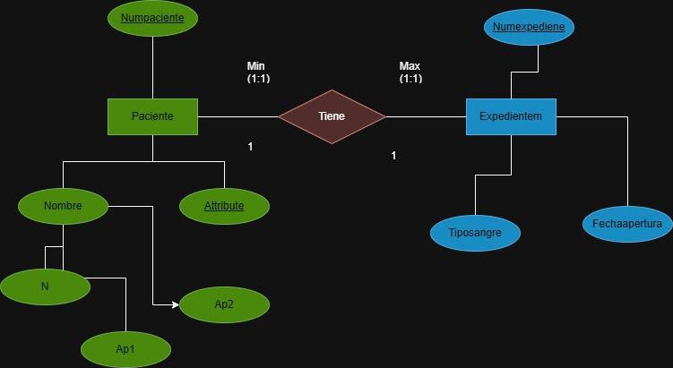
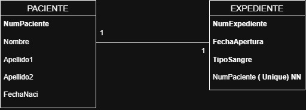

# Diccionario de Datos Ejercicio 1

## 1. Información General

| Elemento | Valor                   |
| :------- | :---------------------- |
| Proyecto | Hospital                |
| Versión  | 1.0                     |
| Fecha    | Junio 2026              |
| Elaboró  | Jesús Gael Mata Jiménez |
| SGBD     | SQL Server              |

---

## 2. Descripción de la Base de Datos

Esta base de datos administra la información de:

* Paciente
* Expediente Médico

Permite registrar la información de los pacientes y mantener un expediente médico único para cada uno, garantizando la integridad de la información.

---

## 3. Catálogo de Restricciones

| Catálogo | Significado               |
| :------- | :------------------------ |
| PK       | Primary Key               |
| FK       | Foreign Key               |
| NN       | Not Null                  |
| UQ       | Unique                    |
| AI       | Auto Increment o Identity |
| CK       | Check                     |
| DF       | Default                   |

---

## 4. Diccionario de Datos

### **Tabla:** *Paciente*

**Descripción**

Almacena la información personal de los pacientes registrados en el hospital.

| Campo       | Tipo    | Longitud | Restricciones | Descripción                       |
| :---------- | :------ | :------- | :------------ | :-------------------------------- |
| NumPaciente | INT     | -        | PK, NN        | Identificador único del paciente. |
| Nombre      | VARCHAR | 50       | NN            | Nombre del paciente.              |
| Apellido1   | VARCHAR | 50       | NN            | Primer apellido del paciente.     |
| Apellido2   | VARCHAR | 50       | NULL          | Segundo apellido del paciente.    |
| FechaNaci   | DATE    | -        | NN            | Fecha de nacimiento del paciente. |

---

### **Tabla:** *Expediente*

**Descripción**

Almacena la información del expediente médico asignado a cada paciente.

| Campo         | Tipo    | Longitud | Restricciones | Descripción                                |
| :------------ | :------ | :------- | :------------ | :----------------------------------------- |
| NumExpediente | INT     | -        | PK, NN        | Identificador único del expediente médico. |
| FechaApertura | DATE    | -        | NN            | Fecha en que se abrió el expediente.       |
| TipoSangre    | VARCHAR | 5        | NN            | Tipo de sangre del paciente.               |
| NumPaciente   | INT     | -        | FK, UQ, NN    | Paciente al que pertenece el expediente.   |

---

## 5. Relaciones en la Base de Datos

| Relación              | Cardinalidad | Descripción                                                                                    |
| :-------------------- | :----------- | :--------------------------------------------------------------------------------------------- |
| Paciente → Expediente | 1:1          | Cada paciente tiene un único expediente médico y cada expediente pertenece a un solo paciente. |

---

## 6. Matriz de Claves Foráneas

| Tabla      | Campo FK    | Referencias           |
| :--------- | :---------- | :-------------------- |
| Expediente | NumPaciente | Paciente(NumPaciente) |

---

## 7. Integridad Referencial

| Clave | Regla                                                             |
| :---- | :---------------------------------------------------------------- |
| IR-01 | No se puede registrar un expediente para un paciente inexistente. |
| IR-02 | No puede existir un expediente médico sin un paciente asociado.   |
| IR-03 | Cada paciente solo puede tener un expediente médico.              |

---

## 8. Reglas del Negocio

| Clave | Regla                                                             |
| :---- | :---------------------------------------------------------------- |
| RN-01 | Cada paciente debe tener exactamente un expediente médico.        |
| RN-02 | Cada expediente médico pertenece a un único paciente.             |
| RN-03 | No puede existir un expediente médico sin un paciente registrado. |
| RN-04 | No puede existir un paciente sin expediente médico.               |

---

## 9. Diagrama Relacional
## Ejercicio 1

### Modelo E-R

### Modelo Relacional

--