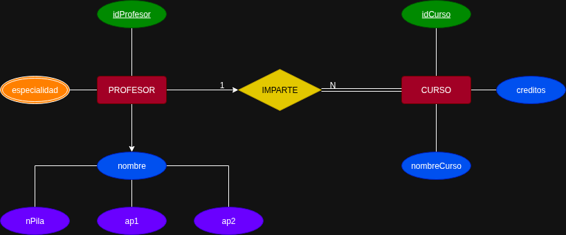
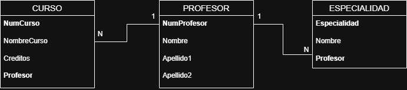

# Diccionario de Datos Ejercicio 2

---

# 1. Información General

| Campo | Información |
| :----- | :---------- |
| Proyecto | Sistema de Gestión de Cursos |
| Versión | 1.0 |
| Fecha | Junio 2026 |
| Elaboró | Jesús Gael Mata Jiménez |
| SGBD | SQL Server |

---

# 2. Descripción de la Base de Datos

La base de datos administra la información correspondiente a los profesores, los cursos impartidos y las especialidades asociadas a cada profesor.

El sistema permite registrar la información de los profesores, almacenar los cursos que imparten y controlar las especialidades de cada uno.

Las tablas principales que conforman la base de datos son:

- Profesor
- Curso
- Especialidad

El objetivo principal de la base de datos es mantener organizada la información académica referente a los profesores y los cursos que imparten, garantizando la integridad y consistencia de los datos.

---

# 3. Catálogo de Restricciones

| Catálogo | Significado |
| :-------- | :---------- |
| PK | Primary Key |
| FK | Foreign Key |
| NN | Not Null |
| UQ | Unique |
| AI | Auto Increment o Identity |
| CK | Check |
| DF | Default |

---

# 4. Diccionario de Datos

## Tabla: Profesor

### Descripción

Almacena la información general de los profesores.

| Campo | Tipo | Longitud | Restricciones | Descripción |
| :---- | :--- | :------- | :------------ | :---------- |
| NumProfesor | INT | 4 | PK, NN | Identificador único del profesor |
| Nombre | VARCHAR | 50 | NN | Nombre del profesor |
| Apellido1 | VARCHAR | 50 | NN | Primer apellido |
| Apellido2 | VARCHAR | 50 | NN | Segundo apellido |

---

## Tabla: Curso

### Descripción

Almacena la información de los cursos impartidos por los profesores.

| Campo | Tipo | Longitud | Restricciones | Descripción |
| :---- | :--- | :------- | :------------ | :---------- |
| NumCurso | INT | 4 | PK, NN | Identificador único del curso |
| NombreCurso | VARCHAR | 100 | NN | Nombre del curso |
| Creditos | INT | 2 | NN | Número de créditos del curso |
| Profesor | INT | 4 | FK, NN | Profesor que imparte el curso |

---

## Tabla: Especialidad

### Descripción

Almacena las especialidades registradas para cada profesor.

| Campo | Tipo | Longitud | Restricciones | Descripción |
| :---- | :--- | :------- | :------------ | :---------- |
| Especialidad | INT | 4 | PK, NN | Identificador de la especialidad |
| Nombre | VARCHAR | 100 | NN | Nombre de la especialidad |
| Profesor | INT | 4 | FK, NN | Profesor al que pertenece la especialidad |

---

# 5. Relaciones en la Base de Datos

| Relación | Cardinalidad | Descripción |
| :-------- | :----------- | :---------- |
| Profesor → Curso | 1 : N | Un profesor puede impartir varios cursos. |
| Profesor → Especialidad | 1 : N | Un profesor puede tener una o varias especialidades. |

---

# 6. Matriz de Claves Foráneas

| Tabla | Campo FK | Referencias |
| :---- | :------- | :---------- |
| Curso | Profesor | Profesor(NumProfesor) |
| Especialidad | Profesor | Profesor(NumProfesor) |

---

# 7. Integridad Referencial

| Clave | Regla |
| :---- | :---- |
| Curso.Profesor | Debe existir previamente un profesor registrado. |
| Especialidad.Profesor | Debe existir previamente un profesor registrado. |

---

# 8. Reglas del Negocio

| Clave | Regla |
| :---- | :---- |
| RN-01 | Cada profesor debe tener un identificador único. |
| RN-02 | Un profesor puede impartir uno o varios cursos. |
| RN-03 | Cada curso debe ser impartido por un único profesor. |
| RN-04 | Un profesor puede registrar una o varias especialidades. |
| RN-05 | Cada especialidad pertenece únicamente a un profesor. |
| RN-06 | El número de créditos de un curso debe ser mayor que cero. |

---

# 9. Diagrama Relacional
## Ejercicio 2

### Modelo E-R

### Modelo Relacional

--