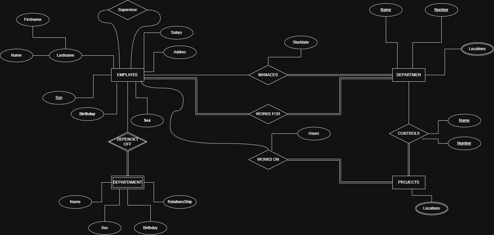
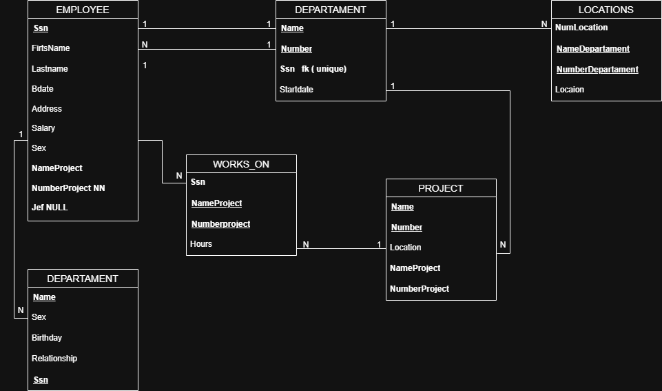

# Diccionario de Datos Ejercicio 5 Versión 1

---

# 1. Información General

| Campo | Información |
| :----- | :---------- |
| Proyecto | Sistema de Gestión de Empleados y Departamentos |
| Versión | 1.0 |
| Fecha | Junio 2026 |
| Elaboró | Jesús Gael Mata Jiménez |
| SGBD |  SQL Server |

---

# 2. Descripción de la Base de Datos

La base de datos administra la información de empleados, departamentos, proyectos y dependientes de una empresa.

Permite registrar los empleados, los departamentos donde trabajan, los proyectos que controla cada departamento, las ubicaciones de los departamentos y las horas trabajadas por cada empleado en un proyecto.

Las tablas principales son:

- EMPLOYEE
- DEPARTAMENT
- PROJECT
- WORKS_ON
- LOCATIONS
- DEPENDENT

Su objetivo es mantener organizada la información administrativa y laboral de la empresa.

---

# 3. Catálogo de Restricciones

| Catálogo | Significado |
| :-------- | :---------- |
| PK | Primary Key |
| FK | Foreign Key |
| NN | Not Null |
| UQ | Unique |
| AI | Auto Increment o Identity |
| CK | Check |
| DF | Default |

---

# 4. Diccionario de Datos

## Tabla: EMPLOYEE

### Descripción

Almacena la información general de los empleados.

| Campo | Tipo | Longitud | Restricciones | Descripción |
| :---- | :--- | :------- | :------------ | :---------- |
| Ssn | CHAR | 9 | PK, NN | Número de seguro social |
| FirstName | VARCHAR | 40 | NN | Nombre |
| Lastname | VARCHAR | 40 | NN | Apellido |
| Bdate | DATE | - | NN | Fecha de nacimiento |
| Address | VARCHAR | 120 | NN | Dirección |
| Salary | DECIMAL | 10,2 | NN | Salario |
| Sex | CHAR | 1 | NN | Sexo |
| NameProject | VARCHAR | 60 | NULL | Proyecto asignado |
| NumberProject | INT | 4 | NULL | Número del proyecto |
| Jef | CHAR | 9 | FK | Supervisor |

---

## Tabla: DEPARTAMENT

### Descripción

Almacena la información de los departamentos.

| Campo | Tipo | Longitud | Restricciones | Descripción |
| :---- | :--- | :------- | :------------ | :---------- |
| Name | VARCHAR | 60 | NN | Nombre del departamento |
| Number | INT | 4 | PK, NN | Número del departamento |
| Ssn_fk | CHAR | 9 | FK, UQ | Gerente del departamento |
| Startdate | DATE | - | NN | Fecha de inicio del gerente |

---

## Tabla: PROJECT

### Descripción

Almacena la información de los proyectos.

| Campo | Tipo | Longitud | Restricciones | Descripción |
| :---- | :--- | :------- | :------------ | :---------- |
| Name | VARCHAR | 60 | NN | Nombre del proyecto |
| Number | INT | 4 | PK, NN | Número del proyecto |
| Location | VARCHAR | 80 | NN | Ubicación |
| NameProject | VARCHAR | 60 | NULL | Nombre alterno del proyecto |
| NumberProject | INT | 4 | NULL | Número alterno del proyecto |

---

## Tabla: WORKS_ON

### Descripción

Relaciona los empleados con los proyectos en los que trabajan.

| Campo | Tipo | Longitud | Restricciones | Descripción |
| :---- | :--- | :------- | :------------ | :---------- |
| Ssn | CHAR | 9 | PK, FK | Empleado |
| NameProject | VARCHAR | 60 | PK | Proyecto |
| NumberProject | INT | PK | Número del proyecto |
| Hours | DECIMAL | 5,2 | NN | Horas trabajadas |

---

## Tabla: LOCATIONS

### Descripción

Almacena las ubicaciones donde opera cada departamento.

| Campo | Tipo | Longitud | Restricciones | Descripción |
| :---- | :--- | :------- | :------------ | :---------- |
| NumLocation | INT | 4 | PK, NN | Identificador |
| NameDepartament | VARCHAR | 60 | NN | Nombre del departamento |
| NumberDepartament | INT | FK | Departamento |
| Location | VARCHAR | 80 | NN | Ubicación |

---

## Tabla: DEPENDENT

### Descripción

Almacena los dependientes de cada empleado.

| Campo | Tipo | Longitud | Restricciones | Descripción |
| :---- | :--- | :------- | :------------ | :---------- |
| Name | VARCHAR | 60 | PK | Nombre del dependiente |
| Sex | CHAR | 1 | NN | Sexo |
| Birthday | DATE | NN | Fecha de nacimiento |
| Relationship | VARCHAR | 30 | NN | Parentesco |
| Ssn | CHAR | 9 | FK | Empleado propietario |

---

# 5. Relaciones en la Base de Datos

| Relación | Cardinalidad | Descripción |
| :-------- | :----------- | :---------- |
| EMPLOYEE → DEPARTAMENT | 1 : 1 | Un empleado administra un departamento. |
| DEPARTAMENT → EMPLOYEE | 1 : N | Un departamento tiene varios empleados. |
| DEPARTAMENT → PROJECT | 1 : N | Un departamento controla varios proyectos. |
| DEPARTAMENT → LOCATIONS | 1 : N | Un departamento posee varias ubicaciones. |
| EMPLOYEE → DEPENDENT | 1 : N | Un empleado puede tener varios dependientes. |
| EMPLOYEE → WORKS_ON | 1 : N | Un empleado trabaja en varios proyectos. |
| PROJECT → WORKS_ON | 1 : N | Un proyecto tiene varios empleados asignados. |

---

# 6. Matriz de Claves Foráneas

| Tabla | Campo FK | Referencias |
| :---- | :------- | :---------- |
| DEPARTAMENT | Ssn_fk | EMPLOYEE(Ssn) |
| LOCATIONS | NumberDepartament | DEPARTAMENT(Number) |
| DEPENDENT | Ssn | EMPLOYEE(Ssn) |
| WORKS_ON | Ssn | EMPLOYEE(Ssn) |

---

# 7. Integridad Referencial

| Clave | Regla |
| :---- | :---- |
| DEPARTAMENT.Ssn_fk | Debe existir un empleado registrado. |
| DEPENDENT.Ssn | Debe existir un empleado registrado. |
| LOCATIONS.NumberDepartament | Debe existir un departamento. |
| WORKS_ON.Ssn | Debe existir un empleado registrado. |

---

# 8. Reglas del Negocio

| Clave | Regla |
| :---- | :---- |
| RN-01 | Un departamento tiene un único gerente. |
| RN-02 | Un gerente debe ser un empleado registrado. |
| RN-03 | Un departamento puede controlar varios proyectos. |
| RN-04 | Un empleado puede participar en varios proyectos. |
| RN-05 | Un proyecto puede tener varios empleados. |
| RN-06 | Cada registro de WORKS_ON debe indicar las horas trabajadas. |
| RN-07 | Un empleado puede registrar varios dependientes. |
| RN-08 | Un departamento puede existir en varias ubicaciones. |

---

# 9. Diagrama Relacional
### Modelo E-R

### Modelo Relacional Versión 1

--