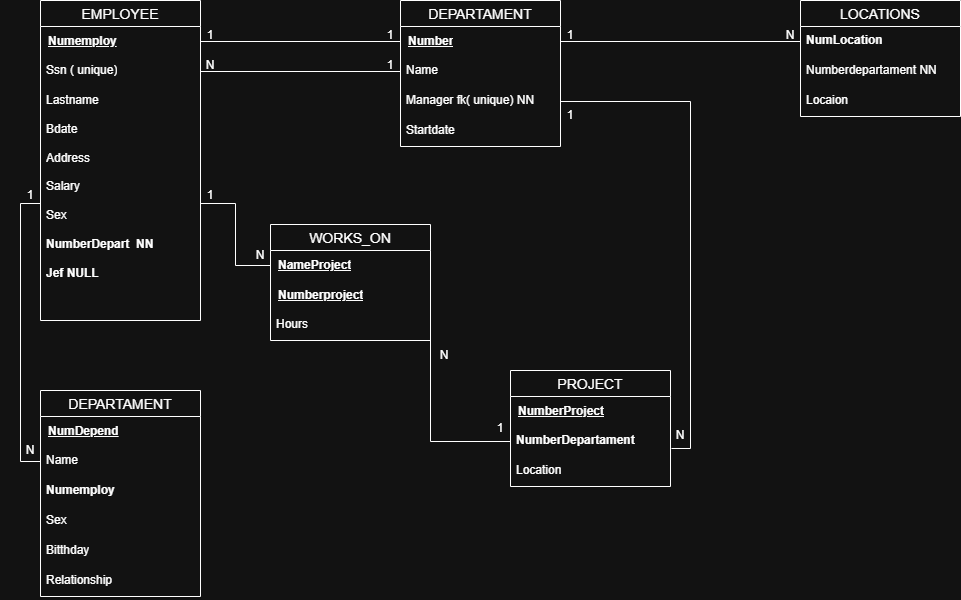

# Diccionario de Datos Ejercicio 5 Versión 2

---

# 1. Información General

| Campo | Información |
| :----- | :---------- |
| Proyecto | Sistema de Gestión de Empleados, Departamentos y Proyectos |
| Versión | 2.0 |
| Fecha | Junio 2026 |
| Elaboró | Jesús Gael Mata Jiménez |
| SGBD | SQL Server |

---

# 2. Descripción de la Base de Datos

La base de datos administra la información de los empleados, departamentos, proyectos, ubicaciones y dependientes de una empresa.

Permite registrar los empleados, el departamento al que pertenecen, el gerente de cada departamento, los proyectos administrados por los departamentos, las ubicaciones donde operan y los dependientes de cada empleado.

Las tablas principales son:

- EMPLOYEE
- DEPARTAMENT
- PROJECT
- WORKS_ON
- LOCATIONS
- DEPENDENT

El objetivo principal de la base de datos es centralizar la información administrativa de la empresa y garantizar la integridad de las relaciones entre empleados, departamentos y proyectos.

---

# 3. Catálogo de Restricciones

| Catálogo | Significado |
| :-------- | :---------- |
| PK | Primary Key |
| FK | Foreign Key |
| NN | Not Null |
| UQ | Unique |
| AI | Auto Increment o Identity |
| CK | Check |
| DF | Default |

---

# 4. Diccionario de Datos

## Tabla: EMPLOYEE

### Descripción

Almacena la información general de los empleados de la empresa.

| Campo | Tipo | Longitud | Restricciones | Descripción |
| :---- | :--- | :------- | :------------ | :---------- |
| NumEmploy | INT | 4 | PK, NN | Identificador del empleado |
| Ssn | CHAR | 11 | UQ, NN | Número de Seguro Social |
| Lastname | VARCHAR | 50 | NN | Apellido del empleado |
| Bdate | DATE | - | NN | Fecha de nacimiento |
| Address | VARCHAR | 120 | NN | Dirección |
| Salary | DECIMAL | 10,2 | NN | Salario |
| Sex | CHAR | 1 | NN | Sexo |
| NumberDepart | INT | 4 | FK, NN | Departamento al que pertenece |
| Jef | INT | 4 | FK | Supervisor inmediato |

---

## Tabla: DEPARTAMENT

### Descripción

Almacena la información de los departamentos de la empresa.

| Campo | Tipo | Longitud | Restricciones | Descripción |
| :---- | :--- | :------- | :------------ | :---------- |
| Number | INT | 4 | PK, NN | Número del departamento |
| Name | VARCHAR | 60 | NN | Nombre del departamento |
| Manager | INT | 4 | FK, UQ, NN | Empleado que administra el departamento |
| Startdate | DATE | - | NN | Fecha de inicio del gerente |

---

## Tabla: PROJECT

### Descripción

Almacena la información de los proyectos administrados por los departamentos.

| Campo | Tipo | Longitud | Restricciones | Descripción |
| :---- | :--- | :------- | :------------ | :---------- |
| NumberProject | INT | 4 | PK, NN | Número del proyecto |
| NumberDepartament | INT | 4 | FK, NN | Departamento responsable |
| Location | VARCHAR | 80 | NN | Ubicación del proyecto |

---

## Tabla: WORKS_ON

### Descripción

Registra la participación de los empleados en los proyectos y las horas trabajadas.

| Campo | Tipo | Longitud | Restricciones | Descripción |
| :---- | :--- | :------- | :------------ | :---------- |
| NameProject | VARCHAR | 60 | PK | Nombre del proyecto |
| NumberProject | INT | 4 | PK, FK | Proyecto asignado |
| Hours | DECIMAL | 5,2 | NN | Horas trabajadas |

---

## Tabla: LOCATIONS

### Descripción

Almacena las ubicaciones donde opera cada departamento.

| Campo | Tipo | Longitud | Restricciones | Descripción |
| :---- | :--- | :------- | :------------ | :---------- |
| NumLocation | INT | 4 | PK, NN | Identificador de la ubicación |
| NumberDepartament | INT | 4 | FK, NN | Departamento al que pertenece |
| Location | VARCHAR | 80 | NN | Dirección o ubicación |

---

## Tabla: DEPENDENT

### Descripción

Almacena la información de los dependientes de los empleados.

| Campo | Tipo | Longitud | Restricciones | Descripción |
| :---- | :--- | :------- | :------------ | :---------- |
| NumDepend | INT | 4 | PK, NN | Identificador del dependiente |
| Name | VARCHAR | 60 | NN | Nombre del dependiente |
| NumEmploy | INT | 4 | FK, NN | Empleado al que pertenece |
| Sex | CHAR | 1 | NN | Sexo |
| Birthday | DATE | - | NN | Fecha de nacimiento |
| Relationship | VARCHAR | 30 | NN | Parentesco con el empleado |

---

# 5. Relaciones en la Base de Datos

| Relación | Cardinalidad | Descripción |
| :------- | :----------- | :---------- |
| DEPARTAMENT → EMPLOYEE | 1 : N | Un departamento tiene varios empleados. |
| EMPLOYEE → DEPARTAMENT | 1 : 1 | Un empleado puede administrar un departamento. |
| DEPARTAMENT → PROJECT | 1 : N | Un departamento administra varios proyectos. |
| DEPARTAMENT → LOCATIONS | 1 : N | Un departamento puede tener varias ubicaciones. |
| EMPLOYEE → DEPENDENT | 1 : N | Un empleado puede registrar varios dependientes. |
| PROJECT → WORKS_ON | 1 : N | Un proyecto puede tener varios registros de trabajo. |

---

# 6. Matriz de Claves Foráneas

| Tabla | Campo FK | Referencias |
| :---- | :------- | :---------- |
| EMPLOYEE | NumberDepart | DEPARTAMENT(Number) |
| EMPLOYEE | Jef | EMPLOYEE(NumEmploy) |
| DEPARTAMENT | Manager | EMPLOYEE(NumEmploy) |
| PROJECT | NumberDepartament | DEPARTAMENT(Number) |
| LOCATIONS | NumberDepartament | DEPARTAMENT(Number) |
| DEPENDENT | NumEmploy | EMPLOYEE(NumEmploy) |
| WORKS_ON | NumberProject | PROJECT(NumberProject) |

---

# 7. Integridad Referencial

| Clave | Regla |
| :---- | :---- |
| EMPLOYEE.NumberDepart | Debe existir un departamento registrado. |
| EMPLOYEE.Jef | Debe existir previamente un empleado registrado como supervisor. |
| DEPARTAMENT.Manager | El gerente debe existir en la tabla EMPLOYEE. |
| PROJECT.NumberDepartament | El departamento debe existir previamente. |
| LOCATIONS.NumberDepartament | La ubicación debe pertenecer a un departamento existente. |
| DEPENDENT.NumEmploy | El empleado debe existir previamente. |
| WORKS_ON.NumberProject | El proyecto debe existir previamente. |

---

# 8. Reglas del Negocio

| Clave | Regla |
| :---- | :---- |
| RN-01 | Un empleado pertenece a un único departamento. |
| RN-02 | Un departamento puede tener varios empleados. |
| RN-03 | Cada departamento tiene un único gerente. |
| RN-04 | Un gerente debe ser un empleado registrado. |
| RN-05 | Un departamento puede administrar varios proyectos. |
| RN-06 | Un departamento puede tener una o varias ubicaciones. |
| RN-07 | Un empleado puede registrar varios dependientes. |
| RN-08 | Las horas trabajadas en un proyecto deben ser mayores que cero. |
| RN-09 | Todo proyecto debe pertenecer a un departamento. |

---

# 9. Diagrama Relacional
### Modelo E-R

### Modelo Relacional Versión 2

--