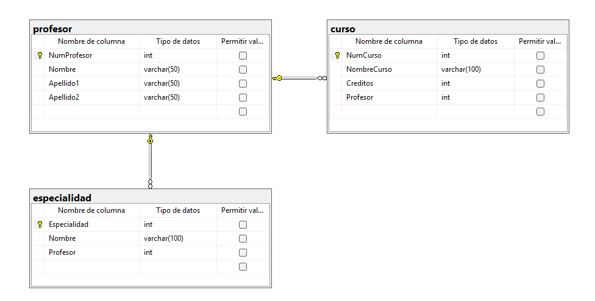

```SQL
CREATE DATABASE Gestion_Cursos;
GO

USE Gestion_Cursos;
GO


-- CREAR TABLA PROFESOR

CREATE TABLE profesor(
	NumProfesor INT NOT NULL IDENTITY(1,1),
	Nombre VARCHAR(50) NOT NULL,
	Apellido1 VARCHAR(50) NOT NULL,
	Apellido2 VARCHAR(50) NOT NULL,

	CONSTRAINT pk_profesor
	PRIMARY KEY (NumProfesor)

);
GO


-- CREAR TABLA CURSO

CREATE TABLE curso(
	NumCurso INT NOT NULL IDENTITY(1,1),
	NombreCurso VARCHAR(100) NOT NULL,
	Creditos INT NOT NULL,
	Profesor INT NOT NULL,

	CONSTRAINT pk_curso
	PRIMARY KEY (NumCurso),

	CONSTRAINT fk_curso_profesor
	FOREIGN KEY (Profesor)
	REFERENCES profesor (NumProfesor)

);
GO


-- CREAR TABLA ESPECIALIDAD

CREATE TABLE especialidad(
	Especialidad INT NOT NULL IDENTITY(1,1),
	Nombre VARCHAR(100) NOT NULL,
	Profesor INT NOT NULL,

	CONSTRAINT pk_especialidad
	PRIMARY KEY (Especialidad),

	CONSTRAINT fk_especialidad_profesor
	FOREIGN KEY (Profesor)
	REFERENCES profesor (NumProfesor)

);
GO
```



