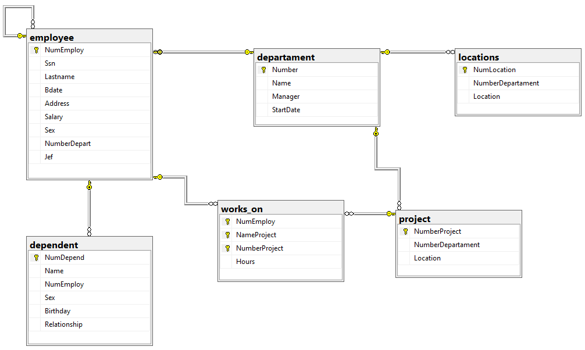

```SQL
CREATE DATABASE v2_gestion_empleados_departamentos;
GO

USE v2_gestion_empleados_departamentos;
GO


-- CREAR TABLA DEPARTAMENT

CREATE TABLE departament(
	Number INT NOT NULL,
	Name VARCHAR(60) NOT NULL,
	Manager INT NOT NULL,
	StartDate DATE NOT NULL,

	CONSTRAINT pk_departament
	PRIMARY KEY (Number),

	CONSTRAINT uq_departament_manager
	UNIQUE (Manager)

);
GO


-- CREAR TABLA EMPLOYEE

CREATE TABLE employee(
	NumEmploy INT NOT NULL IDENTITY(1,1),
	Ssn CHAR(11) NOT NULL,
	Lastname VARCHAR(50) NOT NULL,
	Bdate DATE NOT NULL,
	Address VARCHAR(120) NOT NULL,
	Salary DECIMAL(10,2) NOT NULL,
	Sex CHAR(1) NOT NULL,
	NumberDepart INT NOT NULL,
	Jef INT,

	CONSTRAINT pk_employee
	PRIMARY KEY (NumEmploy),

	CONSTRAINT uq_employee_ssn
	UNIQUE (Ssn),

	CONSTRAINT fk_employee_jef
	FOREIGN KEY (Jef)
	REFERENCES employee(NumEmploy)

);
GO


-- AGREGAR FOREIGN KEY DE DEPARTAMENT CON EMPLOYEE

ALTER TABLE departament
ADD CONSTRAINT fk_departament_manager
FOREIGN KEY (Manager)
REFERENCES employee(NumEmploy);
GO


-- AGREGAR FOREIGN KEY DE EMPLOYEE CON DEPARTAMENT

ALTER TABLE employee
ADD CONSTRAINT fk_employee_departament
FOREIGN KEY (NumberDepart)
REFERENCES departament(Number);
GO


-- CREAR TABLA PROJECT

CREATE TABLE project(
	NumberProject INT NOT NULL,
	NumberDepartament INT NOT NULL,
	Location VARCHAR(80) NOT NULL,

	CONSTRAINT pk_project
	PRIMARY KEY (NumberProject),

	CONSTRAINT fk_project_departament
	FOREIGN KEY (NumberDepartament)
	REFERENCES departament(Number)

);
GO


-- CREAR TABLA WORKS_ON

CREATE TABLE works_on(
	NumEmploy INT NOT NULL,
	NameProject VARCHAR(60) NOT NULL,
	NumberProject INT NOT NULL,
	Hours DECIMAL(5,2) NOT NULL,

	CONSTRAINT pk_works_on
	PRIMARY KEY (NumEmploy, NameProject, NumberProject),

	CONSTRAINT fk_works_on_employee
	FOREIGN KEY (NumEmploy)
	REFERENCES employee(NumEmploy),

	CONSTRAINT fk_works_on_project
	FOREIGN KEY (NumberProject)
	REFERENCES project(NumberProject)

);
GO


-- CREAR TABLA LOCATIONS

CREATE TABLE locations(
	NumLocation INT NOT NULL IDENTITY(1,1),
	NumberDepartament INT NOT NULL,
	Location VARCHAR(80) NOT NULL,

	CONSTRAINT pk_locations
	PRIMARY KEY (NumLocation),

	CONSTRAINT fk_locations_departament
	FOREIGN KEY (NumberDepartament)
	REFERENCES departament(Number)

);
GO


-- CREAR TABLA DEPENDENT

CREATE TABLE dependent(
	NumDepend INT NOT NULL IDENTITY(1,1),
	Name VARCHAR(60) NOT NULL,
	NumEmploy INT NOT NULL,
	Sex CHAR(1) NOT NULL,
	Birthday DATE NOT NULL,
	Relationship VARCHAR(30) NOT NULL,

	CONSTRAINT pk_dependent
	PRIMARY KEY (NumDepend),

	CONSTRAINT fk_dependent_employee
	FOREIGN KEY (NumEmploy)
	REFERENCES employee(NumEmploy)

);
GO


```
